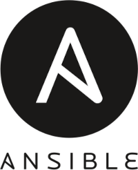

# Getting started with Ansible


<p align="center">

</p>

Course from [Learn Linux TV](https://www.youtube.com/@LearnLinuxTV) about [Ansible](https://youtube.com/playlist?list=PLT98CRl2KxKEUHie1m24-wkyHpEsa4Y70&si=4yVFiKpWzec0q8lS).

Creator: Jay LaCroix

## Commands for SSH

```bash
# Create ssh key pair with type ed25519 on ~/.ssh/
ssh-keygen -t ed25519 -C "ansible"

# Copy public key to server
ssh-copy-id -i ~/.ssh/ansible.pub server_ip_or.domain

# Connect with private key
ssh -i ~/.ssh/ansible server_ip_or.domain

# Create process agent to store passphrase
eval $(ssh-agent)

# Add a passphrase to process agent
ssh-add

# Create alias for process agent
# Hint: Add this alias on .bashrc
alias ssha='eval $(ssh-agent) && ssh-add'
```

## Commands for Ansible

```bash
# Ping for all machines
ansible all --key-file ~/.ssh/ansible -i inventory -m ping

# List hosts
ansible all --list-hosts

# Get informations from hosts
ansible all -m gather_facts

# Run Ad hoc command against servers
ansible all -m apt -a update_cache=true --become --ask-become-pass

# Install package with APT
ansible all -m apt -a name=vim-nox --become --ask-become-pass

# Install latest package with APT
ansible all -m apt -a "name=vim-nox state=latest" --become --ask-become-pass

# Upgrade all packages with APT
ansible all -m apt -a "upgrade=dist" --become --ask-become-pass

# Run a playbook
ansible-playbook --ask-become-pass install_apache.yml

# List tags
ansible-playbook --list-tags main.yml

# Run tag
ansible-playbook --tags mytag --ask-become-pass main.yml
```